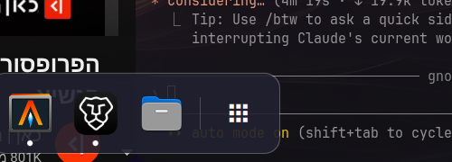

# Gnomarchy

GNOME + Omarchy. A bottom auto-hide dock with pinned + running apps, and a
service that keeps one spare workspace past the highest occupied one — the
two pieces of GNOME's desktop feel that Omarchy doesn't ship on its own,
packaged as one Omarchy 4 (Hyprland + Quickshell) plugin.



## Install (Omarchy)

```bash
omarchy plugin add https://github.com/Emanuel4100/gnomarchy.git --enable
```

Verify with `omarchy plugin list` — it should show up as
`emanuel.gnomarchy`, enabled.

## The dock

This is the `panel` half of the plugin (not `bar`), so it runs alongside
your existing top bar rather than replacing it.

- **One constant-size layer-shell surface per screen.** It never resizes —
  only the visible pill inside it slides via an animated
  `anchors.bottomMargin`. Resizing the surface itself on every show/hide
  round-trips through the compositor and is what makes a naively-built
  auto-hide dock feel janky.
- **Input region (`mask`) lists each interactive piece** (the hover strip,
  the pill, the context menu) via Quickshell's `Region` API, so the empty
  space around them stays click-through to whatever is underneath.
- **Fully event-driven show/hide, zero polling.** A `HoverHandler` on the
  hairline strip and on the pill itself drives a single-shot hide timer —
  no `hyprctl cursorpos` polling loop.
- **Visibility follows the workspace, GNOME-style**: an empty workspace
  shows the dock automatically (nothing to do but launch something); a
  workspace with windows on it hides the dock after you stop hovering it.
  This comes from `Hyprland.toplevels` (already a live reactive model)
  re-checked only on the Hyprland events that could change the answer, not
  a poll either.

Apps come from two sources, matched by window class:

- **Pinned** apps (`pinnedApps` in settings) always appear, in order,
  resolved to a `.desktop` entry via Quickshell's `DesktopEntries` singleton.
- **Running** apps not already pinned are appended after them, one entry per
  distinct window class, with a small dot indicator. Window ↔ desktop-entry
  matching uses each `Hyprland.toplevels` entry's raw `class`/`initialClass`
  against `DesktopEntries.byId`/`heuristicLookup`.

A trailing **apps button** (grid glyph, after a thin divider) opens
Omarchy's own native apps-grid surface —
`Quickshell.execDetached(["omarchy-menu", "toggle", "apps"])`, the same
thing `SUPER+ALT+SPACE` does — rather than building a second, redundant
app-grid overlay.

Click behavior mirrors GNOME's dash: not running → launch; one window →
focus it, or **minimize/restore** if it's already focused (moved to a
hidden `special:dock_minimize` workspace, since Hyprland has no native
minimize); several windows → cycle to the next one that isn't minimized.
Right-click opens New Window / Add-or-Remove Favorite / Quit. Dragging a
pinned icon horizontally reorders it (unpinned running apps aren't
draggable — pin them first via the context menu, same as GNOME).

## Dynamic workspaces

This is the `service` half of the plugin — headless, no UI, no settings.

Keeps exactly one empty spare workspace past whichever numbered workspace is
currently the highest occupied one — GNOME's "there's always one more
workspace waiting" feel, adapted to Hyprland's numbered-workspace model.

Hyprland already destroys a non-persistent empty workspace the moment it's
both empty and unfocused, so the removal half of "dynamic workspaces" needs
nothing from this plugin. It only handles the creation half: whenever the
highest occupied workspace changes, it marks `(highest occupied) + 1` as
`persistent:true` via `hyprctl eval 'hl.workspace_rule({workspace="N",
persistent=true})'`, which eagerly instantiates that workspace with no
window and no focus change, then clears the previous spare's persistent
flag so Hyprland's own default cleanup can reclaim it if it's still empty.
The spare never goes past workspace 10, since only workspaces 1-10 have a
dedicated `SUPER+<key>` bind in Omarchy's default Hyprland config.

**Known limitation**: global, not per-monitor — the "highest occupied"
count spans every monitor, not each one independently.

## Settings

Dock settings only — the workspace service has none. All settings live
entirely in this plugin's own `settings.json`
(`~/.config/omarchy/plugins/emanuel.gnomarchy/settings.json`). The plugin's
only entry in the shared `~/.config/omarchy/shell.json` is the bare
`{"id": "emanuel.gnomarchy"}` enable marker every Omarchy plugin needs.

```bash
omarchy-gnomarchy get <key>
omarchy-gnomarchy set <key> <value>
omarchy-gnomarchy toggle <key>          # enabled or pinned only
omarchy-gnomarchy pin <desktop-id>
omarchy-gnomarchy unpin <desktop-id>
omarchy-gnomarchy set-pinned '<json-array-of-ids>'
```

| Key | Values | Meaning |
|---|---|---|
| `enabled` | `true` / `false` | Master on/off |
| `pinned` | `true` / `false` | Force the dock always visible without losing settings |
| `mode` | `always` / `fullscreen` | Auto-hide always, or only when a window is fullscreen |
| `iconSize` | integer 24-96 | Icon size in px |
| `revealPx` | integer 1-16 | Thickness of the hover-reveal strip |
| `hideDelayMs` | integer | Dwell time (after leaving the dock) before hiding |
| `showAppsButton` | `true` / `false` | Show the trailing "show applications" button |
| `pinnedApps` | JSON array of desktop-entry ids | Favorites, in order |

### Also reachable from the Omarchy menu

There's no packaged way for a plugin to install a menu entry for itself —
Omarchy's menu is defined by two JSONC files merged at load,
`default/omarchy/omarchy-menu.jsonc` (shipped) and
`~/.config/omarchy/extensions/omarchy-menu.jsonc` (yours), and nothing
auto-writes to the latter. Paste this into your own extensions file for a
`SUPER+SPACE → Trigger → Toggle → Dock` entry that enables/disables the
whole plugin (both halves — dock and workspace service together):

```jsonc
"trigger.toggle.dock": {"icon":"󰀻","label":"Dock",
  "action":"if omarchy plugin list --json | jq -e '.[] | select(.id==\"emanuel.gnomarchy\") | .enabled' >/dev/null 2>&1; then omarchy plugin disable emanuel.gnomarchy; else omarchy plugin enable emanuel.gnomarchy; fi"}
```

No `checked` field, matching every other `trigger.toggle.*` entry's shape —
that category is consistently checkmark-free even for stateful toggles
(nightlight, notifications, top-bar visibility). Takes effect immediately,
no `omarchy-restart-shell` needed (verified live: `omarchy plugin
enable`/`disable` mounts/unmounts both the `keepLoaded` panel and service
in the already-running shell).

## Recommended extras (not automated)

Two more GNOME-feel touches this plugin doesn't apply for you — a plugin
has no business silently editing files or settings it doesn't own — but
that go well with it:

**Edge-to-edge tiling.** Paste [`extras/looknfeel-gnome.lua`](extras/looknfeel-gnome.lua)
into your own `~/.config/hypr/looknfeel.lua` for zero gaps/borders and
12px rounded corners.

**Real minimize/maximize/close buttons on GTK apps.** GTK/libadwaita apps
(Nautilus, GNOME Text Editor, etc.) draw their own header-bar buttons based
on this setting:

```bash
gsettings set org.gnome.desktop.wm.preferences button-layout 'appmenu:minimize,maximize,close'
```

This only affects native GTK/libadwaita apps — non-GTK windows (terminals,
etc.) have no title bar at all on Hyprland, GTK or otherwise.

## Files

- `manifest.json` — plugin manifest (`kinds: ["panel", "service"]`)
- `Dock.qml` — the dock's UI and logic
- `WorkspaceService.qml` — the dynamic-workspaces logic
- `bin/omarchy-gnomarchy` — dock settings CLI, symlinked into `~/.local/bin`
- `extras/looknfeel-gnome.lua` — optional Hyprland tiling snippet (see above)

## Developing this plugin

`keepLoaded: true` (required for the `panel` half to auto-mount at shell
startup at all — without it, panels only load on IPC `summon`) means saving
`Dock.qml` does **not** hot-reload the running instance: the file-watcher
fires (`quickshell log` shows "Local plugin changed, reloading"), but the
already-mounted panel instance is kept and keeps running the old code.
`WorkspaceService.qml` behaves the same way for the same reason
`service`-kind plugins generally do — the already-running instance is
cached across hot-reload regardless of `keepLoaded`. Run
`omarchy-restart-shell` after editing either file to actually see changes.
